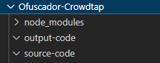

# <Ofuscador-Js>

## Installation - Necessary packages

Create node project with the command

```bash
npm init
```

install the following packages (fs version 0.0.1-security,javascript-obfuscator version 4.1.0)

```bash
npm i fs@0.0.1-security
npm i javascript-obfuscator@4.1.0
```

## Creation of folders in the project

In the root folder of the project create the folder
**source-code** will contain the original source code files without obfuscation

In the root folder of the project create the folder
**output-code** will contain the files after obfuscation



## Creation of Index.js
Create a file in the root folder of the Index.js project and copy the following content
```jsx
const fs = require("fs");
const JavaScriptObfuscator = require('javascript-obfuscator');

//array with all the names of the files in the source-code directory that will be obfuscated
const arraySourceCode = [
    "login.js",
    "background-script.js",
    "home.js",
    "popup.js",
    "buscar.js",
    "scrips.js"
]

//setting
var config = { 
  compact: true,
	controlFlowFlattening: true,
	controlFlowFlatteningThreshold: 1,
	deadCodeInjection: true,
	deadCodeInjectionThreshold: 1,
	debugProtection: false,
	debugProtectionInterval: false,
	disableConsoleOutput: true,
	identifierNamesGenerator: 'hexadecimal',
	log: false,
	mangle: false,
	renameGlobals: false,
	rotateStringArray: true,
	selfDefending: true,
	stringArray: true,
	stringArrayEncoding: ['rc4'],
	stringArrayThreshold: 1,
	stringArrayIndexShift: true,
	stringArrayWrappersCount: 3,
  stringArrayWrappersChainedCalls: true,
	stringArrayWrappersParametersMaxCount: 4, 
  stringArrayWrappersType: 'function',
	unicodeEscapeSequence: false,
	splitStrings: true,
	splitStringsChunkLength: 15,
	transformObjectKeys: true,
	numbersToExpressions: true,
  debugProtectionInterval: 4000
};

//command for obfuscation
function obfuscatefile(nombre){
    fs.readFile("./source-code/"+nombre, "UTF-8", function(err, data) {
        if (err) { 
			throw err;
		}
        var obfuscationResult = JavaScriptObfuscator.obfuscate(data,config);
        fs.writeFile("./output-code/"+nombre, obfuscationResult.getObfuscatedCode(),
        function(err) {
            if(err) { return console.log(err); }
            console.log("File ready and obfuscated: ",nombre);
        });
    });
}

//executing obfuscation on all names in the array
 arraySourceCode.forEach(function(filename) {
    obfuscatefile(filename)
}); 
```

## run the obfuscator
go to the root directory of the project and run index.js with node

### Installation - Necessary packages

```bash
node index.js
```
## the output
the output of obfuscated files will be in the output-code directory,
the message in the console will be "File ready and obfuscated"

### Details used for compilation
*Windows 10 Enterprise - 22H2 - 19045.3930
*Intel(R) Core(TM) i3-2120 CPU @ 3.30GHz   3.30 GHz 8,00 GB Ram momory
*64-bit operating system, x64 processor
*Node Version v21.5.0
*NPM Version 10.2.4


*[Used project directory](https://github.com/luispernalete/Ofuscador-JS)
